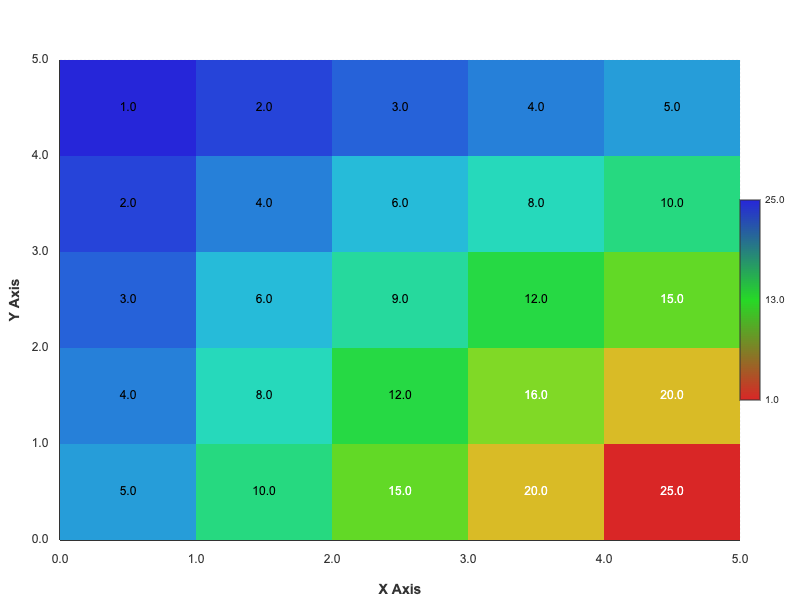

# Ganitt 🎨

**Ganitt - Interactive Math Diagram Component for Web Applications**. Create beautiful mathematical diagrams, graphs, charts, and figures with simple text-based definitions.

---

## 📜 **Copyright & Credits**

**© 2024 Ganitt Component**  
*Created by: Sumedh Patil*  
*Company: Aipresso UK*  
*Contact: admin@aipresso.uk*

*This component is protected by copyright. Unauthorized distribution, modification, or commercial use without explicit permission is prohibited.*

---

## ✨ Features

- **📊 Mathematical Functions**: Linear, quadratic, cubic, exponential, logarithmic, trigonometric, and more
- **📐 Geometric Shapes**: Points, lines, circles, polygons, and custom shapes
- **📈 Statistical Charts**: Histograms, scatter plots, line charts, bar charts
- **🗺️ Coordinate Systems**: Cartesian, polar, and parametric systems
- **🌐 Web Interface**: Interactive editor with real-time preview
- **⚡ High Performance**: Fast rendering with optimized canvas operations
- **📝 Comprehensive Logging**: Detailed error tracking and performance metrics
- **🔧 Node.js Integration**: Use in server-side applications
- **🎯 Easy Syntax**: Simple, intuitive text-based diagram definitions

## 🚀 Quick Start

### Installation

```bash
npm install
```

### Running the Demo

```bash
npm start
```

Then open http://localhost:3001 in your browser!

### Starting the Web Server

```bash
npm start
```

## 📖 Usage Examples

### Mathematical Functions

#### Linear Function
```
math-function
type: linear
equation: "2*x + 3"
range-x: [-5, 5]
range-y: [-5, 15]
color: "#ff0000"
title: "Linear Function"
```

#### Quadratic Function
```
math-function
type: quadratic
equation: "x^2 - 4*x + 3"
range-x: [-2, 6]
range-y: [-5, 10]
color: "#0088ff"
title: "Quadratic Function"
```

#### Exponential Function
```
math-function
type: exponential
equation: "exp(x)"
range-x: [-3, 3]
range-y: [-1, 20]
color: "#ff8800"
title: "Exponential Function"
```

#### Logarithmic Function
```
math-function
type: logarithmic
equation: "log(x)"
range-x: [0.1, 10]
range-y: [-3, 3]
color: "#8800ff"
title: "Logarithmic Function"
```


#### Trigonometric Functions
```
math-function
type: sine
equation: "sin(x)"
range-x: [-6.28, 6.28]
range-y: [-1.5, 1.5]
color: "#00aa00"
title: "Sine Function"

math-function
type: cosine
equation: "cos(x)"
range-x: [-6.28, 6.28]
range-y: [-1.5, 1.5]
color: "#aa00aa"
title: "Cosine Function"
```

### Geometric Shapes

#### Circle
```
geometry-shape
type: circle
coordinates: [{"x": 400, "y": 300}]
radius: 50
fill: true
fill-color: "#ff0000"
stroke-color: "#0000ff"
stroke-width: 3
title: "Circle"
```

#### Rectangle
```
geometry-shape
type: rectangle
coordinates: [{"x": 300, "y": 200}, {"x": 500, "y": 400}]
fill: true
fill-color: "#00ff00"
stroke-color: "#000000"
stroke-width: 2
title: "Rectangle"
```

#### Line
```
geometry-shape
type: line
coordinates: [{"x": 100, "y": 100}, {"x": 700, "y": 500}]
stroke-color: "#ff0000"
stroke-width: 3
title: "Line"
```

#### Triangle
```
geometry-shape
type: polygon
coordinates: [{"x": 400, "y": 100}, {"x": 300, "y": 300}, {"x": 500, "y": 300}]
fill: true
fill-color: "#ffff00"
stroke-color: "#000000"
stroke-width: 2
title: "Triangle"
```

### Statistical Charts

#### Bar Chart
```
statistics-chart
type: bar-chart
data: [10, 25, 15, 30, 20]
labels: ["A", "B", "C", "D", "E"]
color: "#0088ff"
title: "Bar Chart"
```

#### Pie Chart
```
statistics-chart
type: pie-chart
data: [30, 25, 20, 15, 10]
labels: ["Category A", "Category B", "Category C", "Category D", "Category E"]
colors: ["#ff0000", "#00ff00", "#0000ff", "#ffff00", "#ff00ff"]
title: "Pie Chart"
```

#### Line Chart
```
statistics-chart
type: line-chart
data: [10, 15, 13, 17, 6, 9, 15, 25, 20, 18]
labels: ["Jan", "Feb", "Mar", "Apr", "May", "Jun", "Jul", "Aug", "Sep", "Oct"]
color: "#ff8800"
title: "Line Chart"
```

#### Scatter Plot
```
statistics-chart
type: scatter-plot
data: [{"x": 1, "y": 2}, {"x": 2, "y": 5}, {"x": 3, "y": 3}, {"x": 4, "y": 8}, {"x": 5, "y": 6}]
range-x: [0, 6]
range-y: [0, 10]
color: "#8800ff"
title: "Scatter Plot"
```

#### Histogram
```
statistics-chart
type: histogram
data: [5, 8, 12, 15, 8, 6, 3, 1]
range-x: [0, 8]
range-y: [0, 20]
color: "#00aa00"
title: "Histogram"
```



### Coordinate Systems

#### Cartesian Coordinate System
```
coordinate-system
type: cartesian
range-x: [-10, 10]
range-y: [-10, 10]
grid: true
labels: true
title: "Cartesian Coordinate System"
```

#### Polar Coordinate System
```
coordinate-system
type: polar
range-r: [0, 10]
range-theta: [0, 360]
grid: true
labels: true
title: "Polar Coordinate System"
```

## 🔧 Component Integration

### Basic Usage
```javascript
import GanittComponent from './ganitt/ganitt-component.js';

const component = new GanittComponent('my-container', {
  width: 800,
  height: 600,
  autoRender: true
});
```

### Advanced Configuration
```javascript
const component = new GanittComponent('my-container', {
  width: 1000,
  height: 700,
  autoRender: false,
  theme: 'dark',
  showGrid: true,
  showAxes: true,
  showLabels: true
});
```

## 🌐 API Usage

### Render Diagram
```javascript
fetch('/api/render', {
  method: 'POST',
  headers: { 'Content-Type': 'application/json' },
  body: JSON.stringify({
    diagramText: 'math-function\ntype: linear\nequation: "2*x + 1"'
  })
})
.then(res => res.json())
.then(data => console.log(data));
```

### Health Check
```javascript
fetch('/api/health')
.then(res => res.json())
.then(data => console.log(data));
```

## 📁 Project Structure

```
ganitt/
├── ganitt/
│   ├── ganitt-component.js    # Main component
│   └── demo.html           # Demo page
├── src/
│   ├── engine/             # Diagram engine
│   ├── parsers/            # Diagram parsers
│   ├── renderers/         # Canvas renderers
│   ├── types/             # Type definitions
│   ├── utils/             # Utilities
│   └── web/               # Web server
├── package.json            # Package configuration
├── README.md              # This file
└── COMPONENT-USAGE.md      # Detailed usage guide
```

## 🛠️ Development

### Running Tests
```bash
npm test
```

### Building for Production
```bash
npm run build
```

### Development Mode
```bash
npm run dev
```

## 📄 License

**© 2024 Ganitt Component - All Rights Reserved**

*Created by: Sumedh Patil*  
*Company: Aipresso UK*  
*Contact: admin@aipresso.uk*

This software is proprietary and protected by copyright law. Unauthorized reproduction, distribution, or modification is strictly prohibited without written permission from the copyright holder.

## 🤝 Support

For support, licensing inquiries, or custom development:
- **Email**: admin@aipresso.uk
- **Company**: Aipresso UK
- **Developer**: Sumedh Patil

---

*Ganitt - Professional Math Diagram Component for Modern Web Applications*

```bash
npm start
```

Then open http://localhost:3001 in your browser!

## 📖 Usage Examples

### Mathematical Functions

#### Linear Function
```
math-function
type: linear
equation: "2*x + 3"
range-x: [-10, 10]
range-y: [-10, 10]
color: "#ff0000"
line-width: 2
```

#### Sine Wave
```
math-function
type: trigonometric
equation: "sin(x)"
range-x: [0, 6.28]
range-y: [-1.5, 1.5]
color: "#0000ff"
line-width: 2
```

#### Quadratic Function
```
math-function
type: quadratic
equation: "x^2 - 4*x + 3"
range-x: [-2, 6]
range-y: [-5, 15]
color: "#00ff00"
line-width: 2
```

### Geometric Shapes

#### Circle
```
geometry-shape
type: circle
coordinates: [{"x": 400, "y": 300}]
radius: 80
fill: true
fill-color: "#ffcccc"
stroke-color: "#ff0000"
stroke-width: 3
```

#### Triangle
```
geometry-shape
type: polygon
coordinates: [{"x": 400, "y": 200}, {"x": 300, "y": 400}, {"x": 500, "y": 400}]
fill: true
fill-color: "#ccffcc"
stroke-color: "#00ff00"
stroke-width: 2
```

### Statistical Charts

#### Histogram
```
statistics-chart
type: histogram
data: [1, 2, 2, 3, 3, 3, 4, 4, 4, 4, 5, 5, 5, 5, 5]
bins: 5
color: "#ff6600"
show-mean: true
```

#### Scatter Plot
```
statistics-chart
type: scatter
data: [{"x": 1, "y": 2}, {"x": 2, "y": 4}, {"x": 3, "y": 3}, {"x": 4, "y": 5}]
color: "#009900"
```

### Coordinate Systems

#### Cartesian System
```
coordinate-system
type: cartesian
range-x: [-5, 5]
range-y: [-5, 5]
grid-spacing: 1
show-grid: true
show-axes: true
show-labels: true
```

## 🔧 API Usage

### Node.js Integration

```javascript
import MathDiagramEngine from './src/engine/math-diagram-engine.js';

const engine = new MathDiagramEngine({
  width: 800,
  height: 600
});

// Render a diagram
const result = await engine.render(`
math-function
type: linear
equation: "2*x + 3"
range-x: [-10, 10]
range-y: [-10, 10]
color: "#ff0000"
`);

if (result.success) {
  // Save to file (Node.js)
  const buffer = result.canvas.toBuffer('image/png');
  require('fs').writeFileSync('diagram.png', buffer);
}
```

### Web API

```javascript
// POST /api/render
const response = await fetch('http://localhost:3000/api/render', {
  method: 'POST',
  headers: { 'Content-Type': 'application/json' },
  body: JSON.stringify({
    diagramText: `
math-function
type: linear
equation: "x"
range-x: [-10, 10]
range-y: [-10, 10]
`
  })
});

const result = await response.json();
if (result.success) {
  const img = document.createElement('img');
  img.src = result.imageData;
  document.body.appendChild(img);
}
```

## 📊 Supported Diagram Types

### Mathematical Functions
- **Linear Functions**: `y = mx + b`
- **Quadratic Functions**: `y = ax² + bx + c`
- **Cubic Functions**: `y = ax³ + bx² + cx + d`
- **Polynomial Functions**: Higher degree polynomials
- **Exponential Functions**: `y = a^x`
- **Logarithmic Functions**: `y = log(x)`
- **Trigonometric Functions**: sin, cos, tan, etc.
- **Hyperbolic Functions**: sinh, cosh, tanh

### Geometric Shapes
- **Points**: Individual coordinates
- **Lines**: Connected points
- **Circles**: Center point + radius
- **Polygons**: Multiple vertices
- **Arcs**: Circular segments

### Statistical Charts
- **Histograms**: Frequency distributions
- **Scatter Plots**: Correlation visualization
- **Line Charts**: Time series data
- **Bar Charts**: Categorical data

### Coordinate Systems
- **Cartesian**: Standard x-y plane
- **Polar**: r-θ coordinates
- **Parametric**: x(t), y(t) functions

## 🎨 Customization Options

### Colors
- Hex colors: `"#ff0000"`
- RGB colors: `"rgb(255, 0, 0)"`
- Named colors: `"red"`

### Styling
- Line width: `line-width: 2`
- Fill colors: `fill-color: "#00ff00"`
- Stroke colors: `stroke-color: "#000000"`
- Font settings: `font-family: "Arial"`

### Ranges and Scaling
- X-axis range: `range-x: [-10, 10]`
- Y-axis range: `range-y: [-5, 15]`
- Grid spacing: `grid-spacing: 1`

## 🧪 Testing

Run the comprehensive test suite:

```bash
npm test
```

Run the demo with all diagram types:

```bash
npm run dev
```

## 📁 Project Structure

```
math-diagram-engine/
├── src/
│   ├── engine/           # Core rendering engine
│   ├── parsers/          # Text parsing and validation
│   ├── renderers/        # Canvas-based rendering
│   ├── utils/            # Logging and utilities
│   ├── types/            # Type definitions
│   ├── web/              # Web server and interface
│   └── index.js          # Main entry point
├── tests/                # Test suite
├── examples/             # Demo scripts
├── docs/                 # Documentation
├── logs/                 # Log files
└── assets/               # Static resources
```

## 🔍 Logging and Debugging

The engine includes comprehensive logging:

```javascript
import logger from './src/utils/logger.js';

// View log statistics
console.log(logger.getLogStats());

// Clear logs
logger.clearLogs();

// Custom logging
logger.info('Custom message', { data: 'value' });
logger.error('Error occurred', { error: 'details' });
```

Log files are stored in `logs/math-diagram-engine.log`.

## 🚀 Performance

- **Fast Rendering**: Optimized canvas operations
- **Efficient Parsing**: Quick text-to-object conversion
- **Memory Management**: Automatic cleanup
- **Batch Processing**: Support for multiple diagrams

## 🤝 Contributing

1. Fork the repository
2. Create a feature branch
3. Add tests for new functionality
4. Ensure all tests pass
5. Submit a pull request

## 📄 License

MIT License - see LICENSE file for details.

## 🙏 Acknowledgments

- Inspired by **Mermaid.js** for text-based diagram syntax
- Uses **math.js** for mathematical expression parsing
- Canvas rendering based on **node-canvas** for Node.js compatibility
- UI/UX design inspired by modern web applications

## 📞 Support

- 📧 Issues: Report bugs on GitHub
- 📖 Documentation: Check the examples directory
- 🌐 Web Interface: http://localhost:3000
- 🔧 API Documentation: http://localhost:3000/api

---

**Built with ❤️ for mathematics enthusiasts and educators!**
