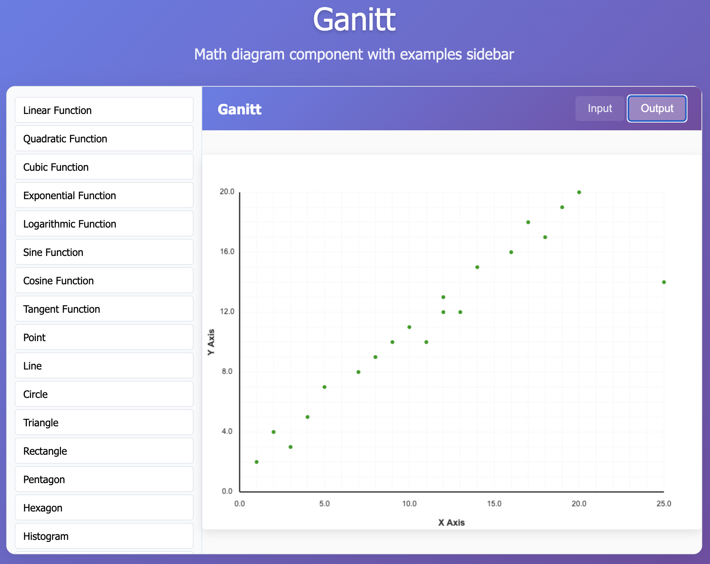

# Ganitt

**A text-based mathematical diagram engine — like Mermaid, but built for math.**

Ganitt lets you define graphs, geometric shapes, statistical charts, and coordinate systems using a simple, readable syntax. It renders them instantly to interactive canvas — no code, no configuration overhead.



---

## What is Ganitt?

Ganitt is a mathematical diagram engine inspired by the simplicity of Mermaid.js. Where Mermaid brought text-based flowcharts and sequence diagrams to the web, Ganitt does the same for mathematics. Define a quadratic function, a polar coordinate system, or a scatter plot in a few lines of plain text — Ganitt handles the rest.

It was built to solve a specific gap: there was no lightweight, text-driven tool that could render publication-quality mathematical figures directly in a web application without heavy dependencies or manual canvas scripting. Ganitt fills that gap by combining an expressive syntax with a high-performance Node.js rendering engine built on top of `math.js` and `node-canvas`.

Whether you're building an educational platform, a data dashboard, or a scientific visualization tool, Ganitt gives you a clean, composable API to generate figures programmatically or through a live web editor.

**Key capabilities:**
- Mathematical functions — linear, quadratic, cubic, exponential, logarithmic, trigonometric, hyperbolic
- Geometric shapes — points, lines, circles, polygons, arcs
- Statistical charts — histograms, scatter plots, line charts, bar charts, pie charts
- Coordinate systems — Cartesian, polar, parametric
- Live web editor with real-time preview
- Node.js API for server-side rendering and batch processing
- Comprehensive logging and performance metrics

---

## Installation

```bash
npm install
npm start
```

Open `http://localhost:3001` in your browser.

---

## Syntax

Each diagram block starts with a type keyword, followed by key-value properties.

### Mathematical Functions

```
math-function
type: linear
equation: "2*x + 3"
range-x: [-5, 5]
range-y: [-5, 15]
color: "#ff0000"
title: "Linear Function"
```

```
math-function
type: sine
equation: "sin(x)"
range-x: [-6.28, 6.28]
range-y: [-1.5, 1.5]
color: "#0088ff"
title: "Sine Wave"
```

### Geometric Shapes

```
geometry-shape
type: circle
coordinates: [{"x": 400, "y": 300}]
radius: 80
fill: true
fill-color: "#ffcccc"
stroke-color: "#ff0000"
stroke-width: 3
```

```
geometry-shape
type: polygon
coordinates: [{"x": 400, "y": 200}, {"x": 300, "y": 400}, {"x": 500, "y": 400}]
fill: true
fill-color: "#ccffcc"
stroke-color: "#00aa00"
stroke-width: 2
title: "Triangle"
```

### Statistical Charts

<table>
<tr>
<td>

```
statistics-chart
type: bar-chart
data: [10, 25, 15, 30, 20]
labels: ["A", "B", "C", "D", "E"]
color: "#0088ff"
title: "Bar Chart"
```

</td>
<td>

```
statistics-chart
type: scatter-plot
data: [{"x":1,"y":2},{"x":2,"y":5},
       {"x":3,"y":3},{"x":4,"y":8}]
color: "#8800ff"
title: "Scatter Plot"
```

</td>
<td>

```
statistics-chart
type: pie-chart
data: [30, 25, 20, 15, 10]
labels: ["A","B","C","D","E"]
colors: ["#ff0000","#00ff00",
         "#0000ff","#ffff00","#ff00ff"]
title: "Pie Chart"
```

</td>
</tr>
</table>

### Coordinate Systems

```
coordinate-system
type: cartesian
range-x: [-10, 10]
range-y: [-10, 10]
grid: true
labels: true
title: "Cartesian Coordinate System"
```

---

## API

### Node.js

```javascript
import MathDiagramEngine from './src/engine/math-diagram-engine.js';

const engine = new MathDiagramEngine({ width: 800, height: 600 });

const result = await engine.render(`
math-function
type: quadratic
equation: "x^2 - 4*x + 3"
range-x: [-2, 6]
range-y: [-5, 10]
color: "#0088ff"
`);

if (result.success) {
  fs.writeFileSync('diagram.png', result.canvas.toBuffer('image/png'));
}
```

### Web

```javascript
const response = await fetch('/api/render', {
  method: 'POST',
  headers: { 'Content-Type': 'application/json' },
  body: JSON.stringify({ diagramText: '...' })
});

const { imageData } = await response.json();
```

---

## Project Structure

```
ganitt/
├── src/
│   ├── engine/       # Core rendering engine
│   ├── parsers/      # Text-to-object parsing
│   ├── renderers/    # Canvas rendering
│   ├── utils/        # Logging, utilities
│   └── web/          # Web server
├── ganitt/
│   ├── ganitt-component.js
│   └── demo.html
└── examples/
```

---

## License & Credits

© 2024 Ganitt — All Rights Reserved  
Created by **Sumedh Patil** · [Aipresso UK](mailto:admin@aipresso.uk)

This software is proprietary. Unauthorized distribution or modification without written permission is prohibited. For licensing inquiries, contact `admin@aipresso.uk`.
